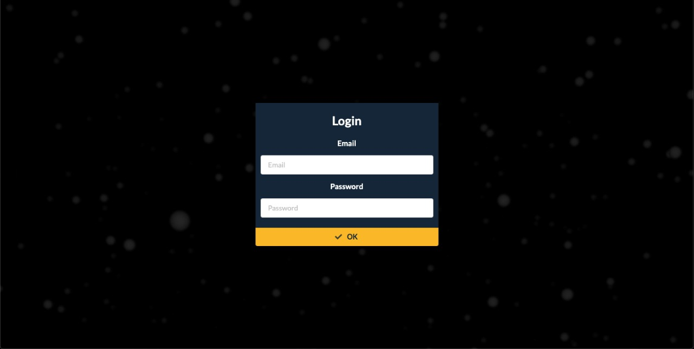
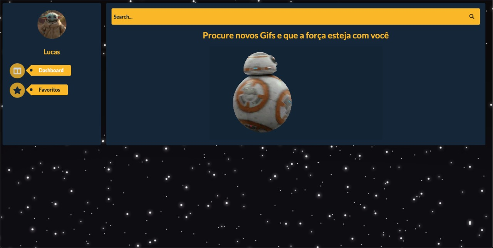
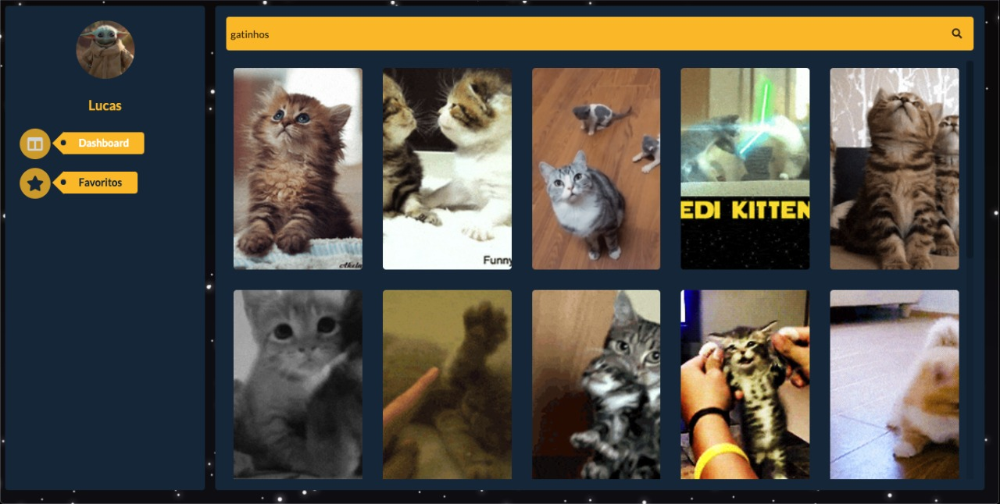
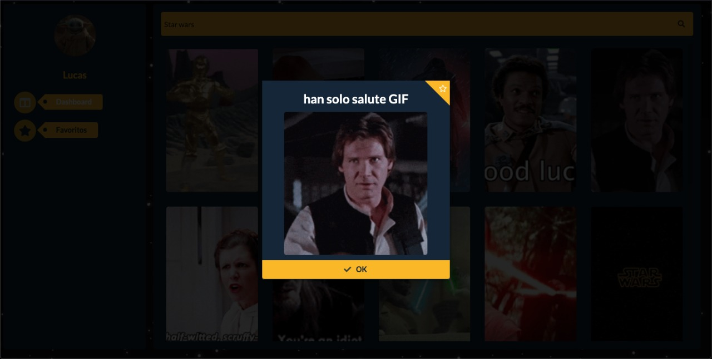
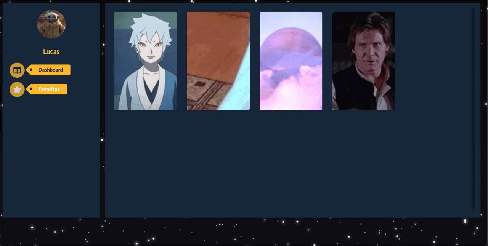
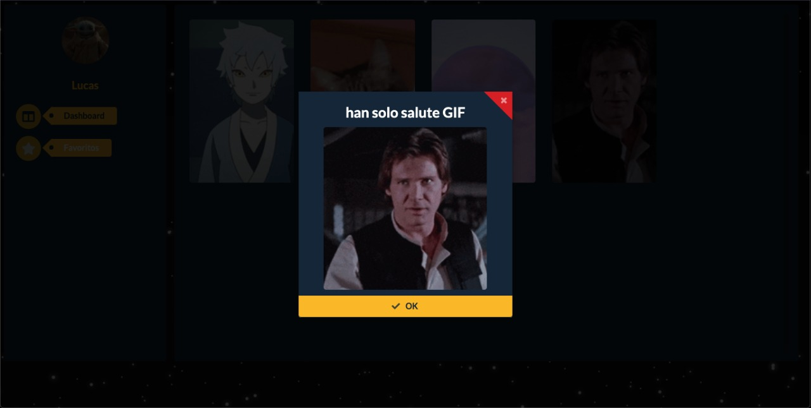

**Teste o site**
[https://alianca-rebelde.netlify.app/](https://alianca-rebelde.netlify.app/)

# Aliança Rebelde

Seja bem vindo a aplicação que pretende por um fim de uma vez por todas no Darth Vader.  Nela você poderá pesquisar e salvar os melhores gifs para combate-lo com os **melhores** e **mais fofos** memes de gatinho.

## Entendendo a interface

Ao entrar na aplicação você deverá inserir um email e uma senha. (Por enquanto é só por demonstração mas pretendo criar um sistema de autorização em breve). Depois disso é só clicar no botão ok 😁!

 
 

Agora você está na página principal onde tem duas opções:
 - Dashboard: Onde você pode pesquisar por gifs novos.
 - Favoritos: Onde você pode ver ou excluir seus gifs favoritos.

 
 

### Dashboard
Aqui você poderá fazer a busca por qualquer gif que imaginar! É só digitar a pesquisa no campo de pesquisa amarelo e confirmar a pesquisa.

 
 

Quando achar algum gif que tenha gostado, é só clicar nele e aparecerá uma janelinha onde você pode clicar no botão amarelo com uma estrelinha no canto superior direito para adicioná-lo aos seus favoritos. Caso mude de ideia é só clicar no botão amarelo na parte de baixo da janela escrito **OK**.

 
 

### Favoritos

Agora que você já tem alguns dos seus gifs favoritos salvos, você pode vê-los clicando no botão **Favoritos** localizado no menu do lado esquerdo.

 
 

Nos favoritos você poderá vizualizar seus gifs salvos clicando em um deles para abrir uma janela onde você pode alterar o nome (clicando no nome dele e alterando para algum de sua preferência), ou excluí-lo dos seus favoritos clicando no botão vermelho com o **X** no canto superior direito. Caso não queira fazer nada é só clicar no botão **OK** .

 
 

# 
###  Próximas features

 - Criação de login e sistema de autenticação com JWT.
 - Compartilhamento de Gifs por Whatsapp ou Facebook.

